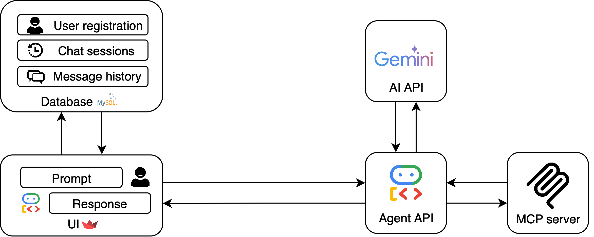

# 📚 AI Agents Platform Documentation

Welcome to the comprehensive documentation for the AI Agents Platform. This section contains detailed guides, technical references, and information for developers.

## 🚀 Quick Start

1. **Clone the repository:**
   ```bash
   git clone https://github.com/ailtonacr/ai-agents.git
   cd ai-agents
   ```
2. **Set up virtual environment:**
   ```bash
   python -m venv venv
   source venv/bin/activate  # Linux/macOS
   # or venv\Scripts\activate  # Windows
   ```
3. **Install dependencies:**
   ```bash
   make setup
   # or
   pip install -r requirements.txt
   ```
4. **Configure environment variables:**
   - Copy and edit `.env` as described in [installation.md](docs/installation.md)
5. **Run the application:**
   ```bash
   make run
   ```

For detailed instructions, see [installation.md](docs/installation.md).

---

### Documentation Index

| Topic                  | Document                        |
|------------------------|---------------------------------|
| Installation           | [installation.md](docs/installation.md) |
| Features & Usage       | [features.md](docs/features.md)         |
| Architecture           | [architecture.md](docs/architecture.md) |
| Development/Contribute | [development.md](docs/development.md)   |
| Logging System         | [logging.md](docs/logging.md)           |

---

## 🖼️ System Diagram



---

## 📖 Documentation Structure

### Conventions
- **📦** Installation and setup
- **✨** User features
- **🏗️** Architecture and design
- **👨‍💻** Development and contribution
- **📝** APIs and technical references

### Documentation Levels

1. **README.md** (root): Overview and quick start
2. **docs/** (this folder): Detailed documentation
3. **Code**: Docstrings and inline comments

---

## 🔍 Finding Information

### By Topic

| Topic | Document | Section |
|-------|----------|---------|
| Initial installation | [installation.md](docs/installation.md) | All |
| Login and authentication | [features.md](docs/features.md) | Authentication System |
| Chat with agents | [features.md](docs/features.md) | Chat System |
| Administration | [features.md](docs/features.md) | Admin Panel |
| Code architecture | [architecture.md](docs/architecture.md) | All |
| How to contribute | [development.md](docs/development.md) | All |
| Logs and monitoring | [logging.md](docs/logging.md) | All |

### By Persona

#### 👤 End User
- [Features](docs/features.md) → Chat System
- [Features](docs/features.md) → Authentication System

#### 👨‍💼 Administrator
- [Installation](docs/installation.md) → Complete Setup
- [Features](docs/features.md) → Admin Panel

#### 👨‍💻 Developer
- [Architecture](docs/architecture.md) → Overview
- [Development](docs/development.md) → Code Standards

#### 🔧 DevOps/SysAdmin
- [Installation](docs/installation.md) → Production Setup
- [Architecture](docs/architecture.md) → Scalability
- [Logging](docs/logging.md) → Monitoring & Debugging

---

## 📚 External Resources

### Main Dependencies
- [Streamlit Documentation](https://docs.streamlit.io/)
- [Google ADK Documentation](https://google.github.io/adk-docs/)
- [MySQL Documentation](https://dev.mysql.com/doc/)
- [bcrypt Documentation](https://pypi.org/project/bcrypt/)

### Development Tools
- [Black Code Formatter](https://black.readthedocs.io/)
- [pytest Documentation](https://docs.pytest.org/)
- [Unittest Documentation](https://docs.python.org/3/library/unittest.html)
- [Conventional Commits](https://www.conventionalcommits.org/)

### Standards and Practices
- [Clean Architecture](https://blog.cleancoder.com/uncle-bob/2012/08/13/the-clean-architecture.html)
- [Python PEP 8](https://pep8.org/)
- [Semantic Versioning](https://semver.org/)

## 🔄 Documentation Maintenance

### Updates
- Documentation must be updated along with the code
- Each PR should include relevant documentation updates
- Reviews should check documentation consistency

### Versioning
- Documentation versioned with the code
- Changelog maintained in the main README
- Releases tagged with Git

### Feedback
- Issues for documentation improvements
- Suggestions via GitHub Discussions
- Documentation reviews are welcome

## 📞 Support

### Help Channels
1. **Documentation**: First source of information
2. **GitHub Issues**: For bugs and specific problems
3. **GitHub Discussions**: For questions and discussions

### Contributing to Documentation
1. Fork the repository
2. Edit or create Markdown files
3. Follow established conventions
4. Submit a Pull Request

---

## 📝 License

This project is licensed under the [MIT License](LICENSE).

**This documentation is community-maintained and always evolving. Contributions are welcome!**
